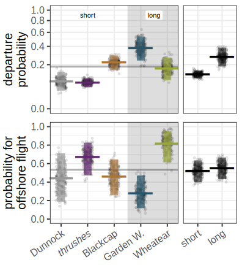
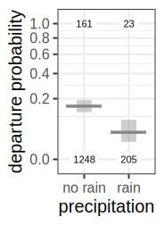

# Introduction

Bird migration is defined by a sequential series of **trade-off decisions**, including departure, routing, and landing decisions. In combination, these three aspects shape the spatio-temporal patterns of an individual movement, and are thus directly linked to the distance travelled per time unit and to energy consumption, i.e. cost of transport under variable environmental conditions. [@schmaljohann2022].

Individual migratory decisions during autumn migration likely depend on **migration strategy**, i.e. short- or long-distance migrants, and birds of both strategies differently react to prevailing environmental conditions at stopover [@packmor2020]. However, it remains unclear whether migration strategy similarly affects the adjustment of migratory decisions during spring, when early arrivals at the breeding grounds should be mutually beneficial for individual reproductive fitness.

<h2 style="padding-top:20px"> Objectives </h2>

1.  Do departure and routing decisions differ between migration strategies in spring?
2.  How many birds cross the German Bight?
3.  Does migration strategy affect how birds adjust migratory decisions?

# Methods

[{width="90%"}](https://motus.org/)

We equipped 289 songbirds of seven species from both migration strategies with radio tags at coastal stopover sites along the German North Sea coast during spring and tracked them by means of an automated receiver network. Once departed, birds could either cross the German Bight or take a detour along the coast. Using a hierarchical multistate model, we estimated weather effects on daily migratory decisions, i.e. day-to-day departure decisions in concert with routing.

\newpage

# Results

{width="69%"}

1.  Day-to-day departure probability among species was higher in long-distance migrants independently from routing decision.
2.  We estimated that 56% (95% CrI: 47.8--58.2 %) of all birds crossed the German Bight.

{width="80%"}

{width="100%"}

 

::: cap1

The influence of air pressure change and low relative humidity differed between species but not migration strategy.

::: cap1c
Birds more likely departed during times with no precipitation.
:::
:::

<cener>{width="83%"}

3.  We found no consistent differences in reaction norms to prevailing environmental conditions between migration strategies.

# Conclusion

Studying proximate mechanisms on individual departure and routing decisions in concert, our results suggest that migration timing during spring inherently depends on migration strategy, while individual weather related adjustments of migratory decisions are similar between strategies. We therefore suppose that, despite high individual en route flexibility, selection similarly affects birds of different migration strategies during spring in favour of early arrivals at the breeding grounds.

# References

::: {#refs}
:::

::: {style="text-align: auto; display: grid; grid-template-columns: 0.2fr 1.8fr; font-size: 20pt; padding-top:50pt"}

[\*]{style="color: #cc0000; font-size: 120px"}

Map indicating locations of tag deployment (triangles) and receiver stations where birds arrived after a migratory endurance flight (dots, size equals to the number of individuals). The histogram on the left summarises the number of individuals detected per 0.1°. Offshore detections on Helgoland and FINO3 are given in light colours. Dashed black line indicates threshold latitude and longitude for flight categorisation as offshore (to the left) or onshore (to the right) flight.

:::

{width="50%"}

