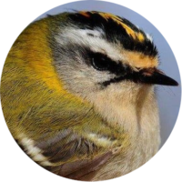
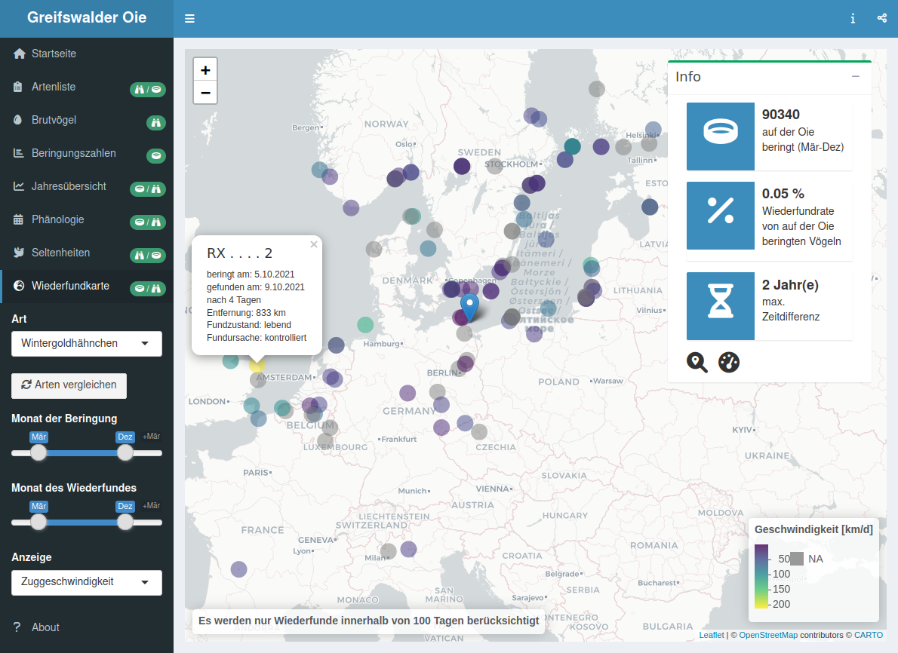
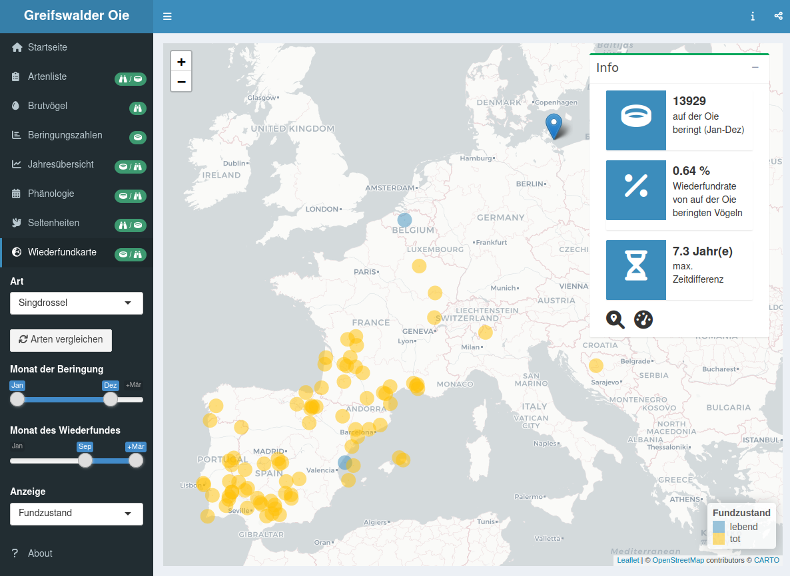
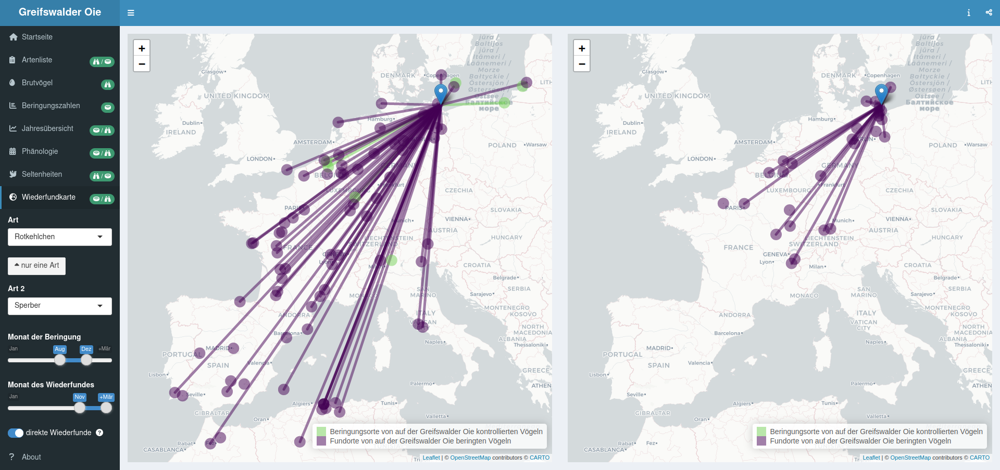

```{r, include=FALSE}
knitr::opts_chunk$set(echo = FALSE,
                      warning = FALSE,
                      tidy = FALSE,
                      message = FALSE,
                      fig.align = 'center',
                      out.width = "100%")
options(knitr.table.format = "html") 
```

# Einleitung

<p style="max-width: 50%; float: left; padding-left: 2cm; padding-right: 2cm">
[{width="90%"}](https://motus.org/)
</p>

Die Greifswalder Oie ist eine 54 ha kleine Insel in der Ostsee, 12 km östlich von Rügen und 10 km nördlich der Insel Usedom. Seit 1993 wird das Naturschutzgebiet im Auftrag des Landes Mecklenburg-Vorpommern vom [Verein Jordsand](https://www.jordsand.de) betreut. Durch ihre geographische Lage vor der Küste ist die Greifswalder Oie prädestiniert für die Erforschung des Vogelzuges über der Ostsee. In Zusammenarbeit mit der [Beringungszentrale Hiddensee](https://www.beringungszentrale-hiddensee.de/) betreibt der Verein Jordsand auf der Insel seit 1994 eine Registrierfangstation zum Monitoring des Vogelzuges. Bis heute wurden über eine halbe Million Vögel aus 196 Arten (überwiegend Singvögel auf dem Frühjahrs- und Herbstzug) beringt. Die Beobachtung der Vogelwelt der Greifswalder Oie wird durch die Kartierungen der Brutvögel, Wasservogelzählungen, Zugplan- und Zufalls- beobachtungen komplettiert. Insgesamt wurden bislang mindestens 319 Arten auf der Greifswalder Oie nachgewiesen.
Um die gesammelten Daten der interessierten Öffentlichkeit zugänglich zu machen, haben wir alle vorhandenen Datenquellen gesichtet, kombiniert und in einer Shiny Applikation (shinyapps.io) visualisiert. Diese frei verfügbare App ermöglicht eine Vielzahl interaktiver Darstellungen, beispielsweise zu Phänologie und Brutbestand einzelner Arten, Beringungszahlen und Jahreszusammenfassungen. Zudem können mit einem Kartentool alle Wiederfunddaten von beringten Vögeln mit Bezug zur Greifswalder Oie dargestellt werden.

## Dank

Wir danken allen ehemaligen und aktiven Helfer:innen, Föjler:innen, Beringer:innen und allen anderen für ihren Beitrag zum Gelingen der Arbeit auf der Insel. Für die Bereitstellung der Kontroll- und Wiederfunddaten von Vögeln mit Bezug zu anderen Beringungszentralen bedanken wir uns bei der Beringungszentrale Hiddensee und dem Dachverband Deutscher Avifaunisten danken wir für die Bereitstellung der ornitho-Daten.

# Phänologie

### Mönchsgrasmücke 

![**Beringungsdaten:** Die ersten Durchzügler erreichen die Insel Ende März, während der Haupt-Heimzug auf die zweite Aprilhälfte fällt. Den Sommer über werden verstärkt lokale Brutvögel gefangen, bis Ende August der Wegzug einsetzt, der im September seinen Höhepunkt erreicht. Einzelne Vögel werden noch bis in den November hinein gefangen. Während die Phänologie sich nicht wesentlich zwischen den Altersklassen unterscheidet, ziehen Männchen im Frühjahr durchschnittlich früher als Weibchen. Zu Beginn der Herbstsaison werden verstärkt auf der Insel erbrütete Jungvögel im Jugendkleid gefangen, bei denen eine Geschlechtsbestimmung noch nicht möglich ist. ](figures/ring_mönchsgrasmücke.svg){width="100%"}

{width="100%"}

### Rotkehlchen

<br>
<br>
<br>
<br>
<br>
<br>
<br>
<br>
<br>
<br>
<br>
<br>
<br>
<br>
<br>
<br>
<br>
<br>

# Wiederfunde

<h3 style="padding-bottom:20px"> Wintergoldhähnchen </h3>

{width="100%"}

<h3 style="padding-bottom:20px"> Singdrossel </h3>

{width="100%"}

<h3 style="padding-top:42px"> Sperber </h3>



<div style="position: absolute; max-width:1800px; bottom:460px; left:1200px">
<p class="caption"> **Artenvergleich:** Die Fundorte von während dem Wegzug auf der Greifswalder Oie beringten Rotkehlchen, die im Winters wiedergefunden wurden, verteilen sich über Frankreich, Spanien und Nordafrika. Sperber ziehen ebenfalls in SW-Richtung, Wiederfunde von der Iberischen Halbinsel im Winter fehlen jedoch bislang. </p>
</div>
